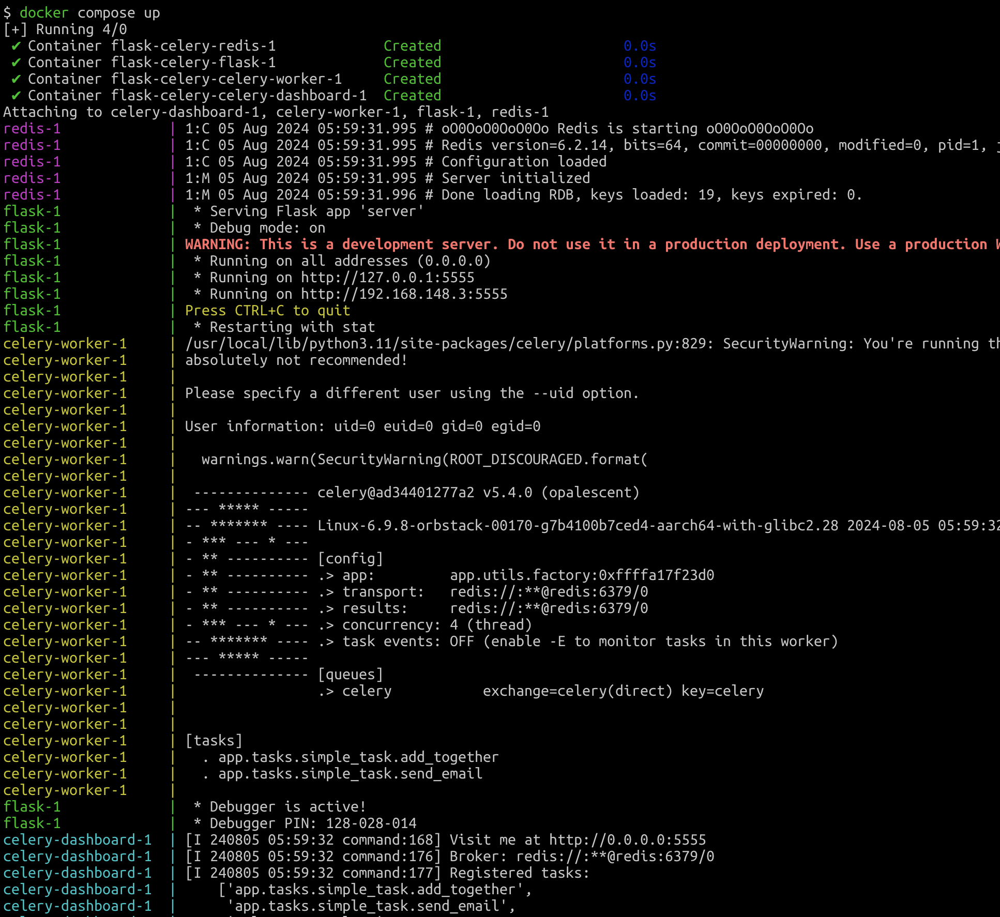

# Flask-Celery Template



## Get Started Option I: Docker

```bash
git submodule update --init --recursive

echo "REDIS_PASSWORD=$(tr -dc A-Za-z0-9 </dev/urandom | head -c 32; echo)" > .env

docker compose build
# Additional labels for build
# --no-cache: build the image from scratch without using cached layers
# -d: runs the containers in detached mode

# Start all services
docker compose up

# Stop all services
docker compose down
```

Flask is running at `http://127.0.0.1:25555`

Celery flower is running at `http://127.0.0.1:25556`, the default username and password are both `admin`

## Get Started Option II: Manually

### Prerequisites

- `Python 3.12`
- `Redis`

You can quickly set up a Redis instance using Docker:

```bash
docker run -d --name celery-redis -p 6379:6379 redis
```

### Manually Running

Start the Celery worker and the Flask development server with the following commands:

```bash
# Start the Celery worker with INFO level logging
celery -A server worker --loglevel INFO

# Run the Flask development server
flask --app server.flask_app run

# Optional: Start the Celery periodic task scheduler (e.g., for auto-backup)
# celery -A server beat --loglevel INFO

# Optional: Display all routes for the Flask application
# flask --app server routes
```

By following these steps, you will have Flask and Celery running, ready to handle tasks efficiently.

## License

This project is licensed under the MIT License.

## Appendix

| Condition                      | Result                                                                                       |
|--------------------------------|----------------------------------------------------------------------------------------------|
| Flask is shut down             | Does not affect Celery                                                                       |
| Celery is shut down            | Flask receives tasks, but no one executes them, so all tasks remain in Pending status        |
| Flask is running, Celery is not | Tasks are submitted to Redis with status Pending; Celery will execute pending tasks once started |
